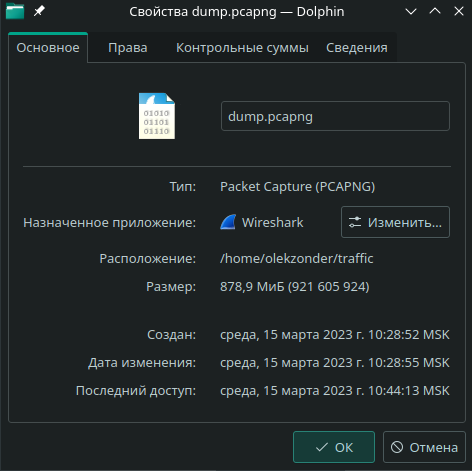

# Сбор и аналитическая обработка информации о сетевом трафике
Александр Смирнов

## Цель работы

1.Развить практические навыки использования современного стека
инструментов сбора и аналитической обработки информации о сетвом трафике

2.Освоить базовые подходы блокировки нежелательного сетевого трафика

3.Закрепить знания о современных сетевых протоколах прикладного уровня

## Ход выполнения практической работы

1.C помощью Wireshark был собран сетевой трафик объёмом 800 Мб:



2.C помощью утилиты Zeek была выделена метаинформация сетевого трафика
(файлы http.log и dns.log в репозитории)

3.Загрузим и соединим файлы, содержащие списки источников нежелательного
трафика:

``` bash
mkdir hosts
wget -q https://github.com/StevenBlack/hosts/raw/master/data/add.2o7Net/hosts -O hosts/hosts.1
wget -q https://raw.githubusercontent.com/StevenBlack/hosts/master/data/KADhosts/hosts -O hosts/hosts.2
wget -q https://raw.githubusercontent.com/StevenBlack/hosts/master/data/yoyo.org/hosts -O hosts/hosts.3
wget -q https://raw.githubusercontent.com/StevenBlack/hosts/master/data/tiuxo/hosts -O hosts/hosts.4
wget -q https://raw.githubusercontent.com/StevenBlack/hosts/master/data/URLHaus/hosts -O hosts/hosts.5
wget -q https://raw.githubusercontent.com/StevenBlack/hosts/master/data/mvps.org/hosts -O hosts/hosts.6
sort hosts/hosts* | grep -Eo '^([^\\"'\''#]|\\.|"([^\\"]|\\.)*"|'\''[^'\'']*'\'')*' | uniq > hosts.data
rm -rf hosts
```

    mkdir: невозможно создать каталог «hosts»: Файл существует

В результате был получен файл hosts.data.

4.Получим список посещённых веб-сайтов, преобразовав файл dns.log в
датафрейм:

``` r
data <- read.csv('dns.log',header=FALSE,sep='   ',skip=8)
domains = data$V10
```

6.Затем преобразуем и файл со списком источников нежелательного трафика:

``` r
data <- read.csv('hosts.data',header=FALSE,sep=' ')
bad_domains = data$V2
```

7.Объединив два полученных датафрейма, получим итоговое количество
нежелательного трафика:

``` r
amount <- sum(domains %in% bad_domains, na.rm=TRUE)
sprintf("Вхождений DNS имён из списков в собранном трафике: %i",amount)
```

    [1] "Вхождений DNS имён из списков в собранном трафике: 946"

``` r
percentile <- amount/length(domains)*100
sprintf("Процент нежелательного трафика: %.2f%%",percentile)
```

    [1] "Процент нежелательного трафика: 21.95%"

## Оценка результата

В результате лабораторной работы мы смогли определить нежелательный
трафик.

## Вывод

Таким образом, мы научились анализировать сетевой трафик и, используя
современный стек инструментов, был освоен подход блокировки
нежелательного сетевого трафика на основе чёрного списка.
