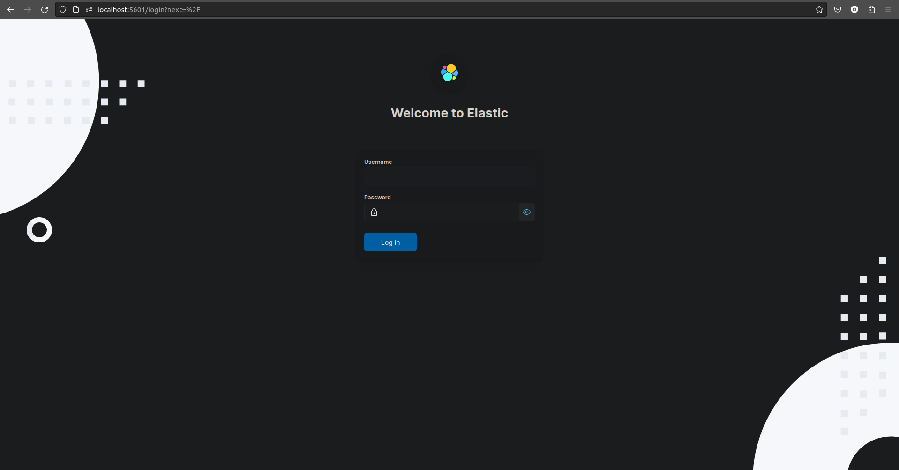
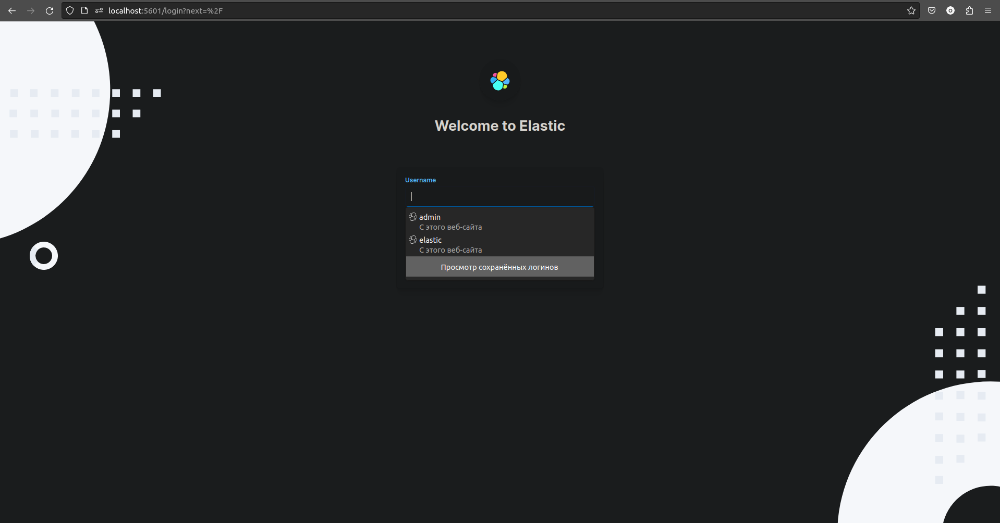
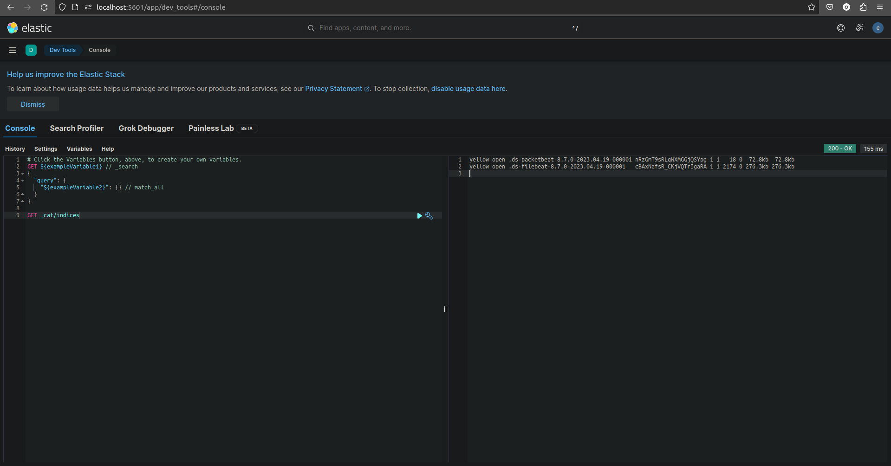
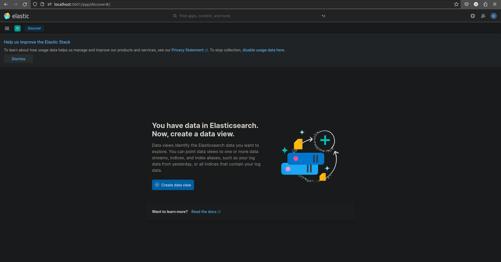
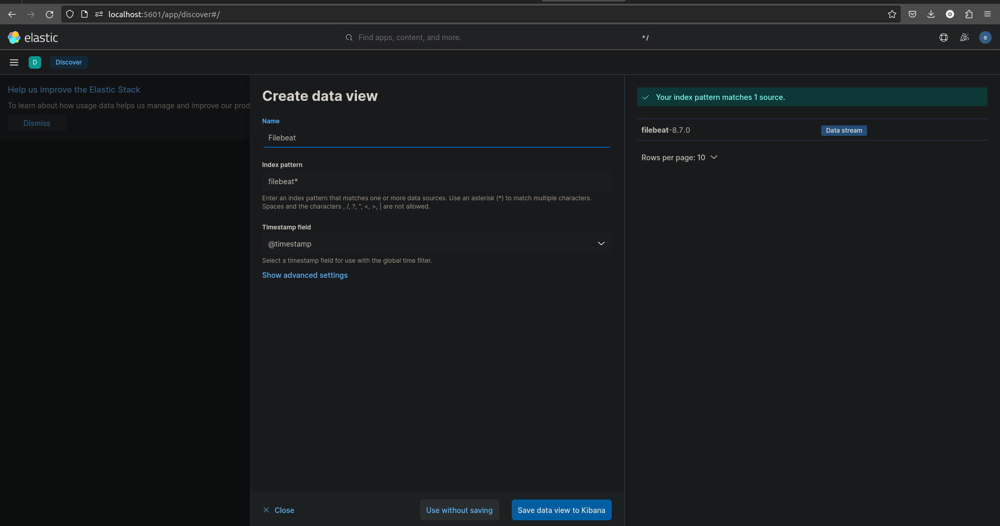
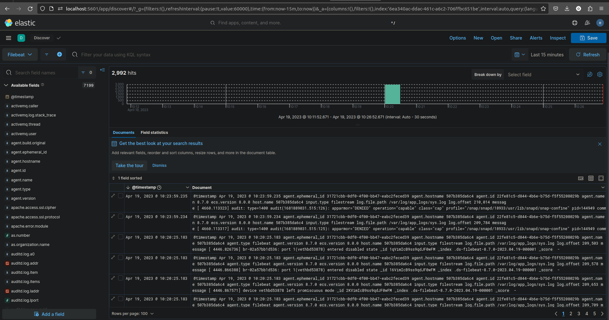
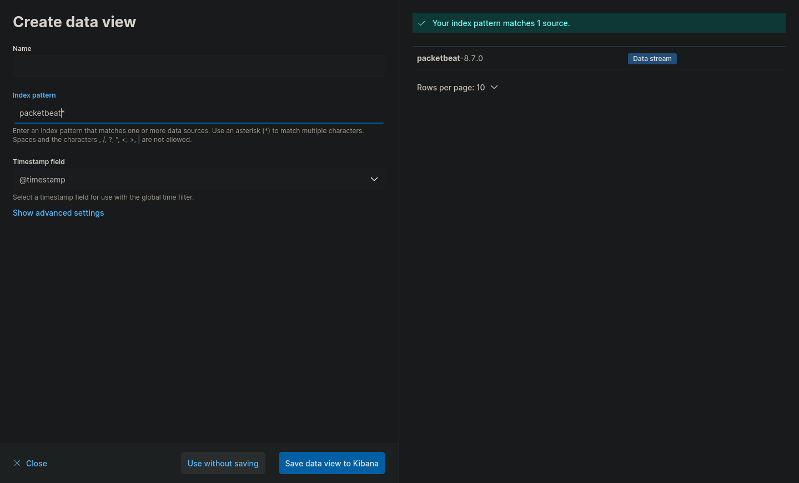
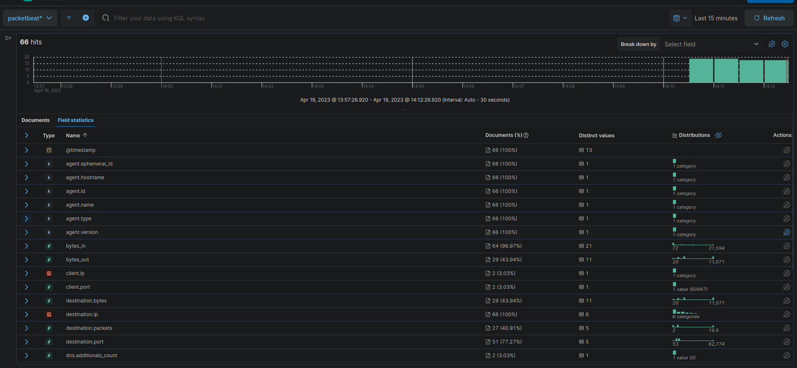

# Развертывание системы мониторинга ELK Stack (ElasticSearch)
Александр Смирнов

## Цель работы

1.  Освоить базовые подходы централизованного сбора и накопления
    информации

2.  Освоить современные инструменты развертывания контейнирозованных
    приложений

3.  Закрепить знания о современных сетевых протоколах прикладного уровня

## Ход выполнения практической работы

Для разворачивания системы сбора информации ElasticSearch была
использована система контейнеризации приложений Docker.

### Шаг 1 - Предварительная конфигурация

#### 1.Для работы ElasticSearch требуется увеличить размер виртуальной памяти системы:

    sudo sysctl -w vm.max_map_count=262144

#### 2.Далее следует подготовить параметры окружения (файл .env):

ELASTIC_PASSWORD – пароль пользователя ‘elastic’

KIBANA_PASSWORD – пароль пользоавтеля ‘kibana_system’

STACK_VERSION – версия устанавливаемых образов ElasticSearch

CLUSTER_NAME – имя кластера

LICENSE – вид лицензии

ES_PORT – порт, который будет использоваться инстансами ElasticSearch

KIBANA_PORT – порт, который будет использоваться графической панелью
управления Kibana

MEM_LIMIT – максимум используемой памяти (в байтах)

### Шаг 2 - создание docker-compose.yml

#### 1.Для создания кластера, использующего надёжное соединение и аутентификацию, создадим сервис, создающий сертификаты:

      setup:
        image: docker.elastic.co/elasticsearch/elasticsearch:${STACK_VERSION}
        volumes:
          - certs:/usr/share/elasticsearch/config/certs
        user: "0"
        command: >
          bash -c '
            if [ x${ELASTIC_PASSWORD} == x ]; then
              echo "Set the ELASTIC_PASSWORD environment variable in the .env file";
              exit 1;
            elif [ x${KIBANA_PASSWORD} == x ]; then
              echo "Set the KIBANA_PASSWORD environment variable in the .env file";
              exit 1;
            fi;
            if [ ! -f config/certs/ca.zip ]; then
              echo "Creating CA";
              bin/elasticsearch-certutil ca --silent --pem -out config/certs/ca.zip;
              unzip config/certs/ca.zip -d config/certs;
            fi;
            if [ ! -f config/certs/certs.zip ]; then
              echo "Creating certs";
              echo -ne \
              "instances:\n"\
              "  - name: es\n"\
              "    dns:\n"\
              "      - es\n"\
              "      - localhost\n"\
              "    ip:\n"\
              "      - 127.0.0.1\n"\
              > config/certs/instances.yml;
              bin/elasticsearch-certutil cert --silent --pem -out config/certs/certs.zip --in config/certs/instances.yml --ca-cert config/certs/ca/ca.crt --ca-key config/certs/ca/ca.key;
              unzip config/certs/certs.zip -d config/certs;
            fi;
            echo "Setting file permissions"
            chown -R root:root config/certs;
            find . -type d -exec chmod 750 \{\} \;;
            find . -type f -exec chmod 640 \{\} \;;
            echo "Waiting for Elasticsearch availability";
            until curl -s --cacert config/certs/ca/ca.crt https://es:9200 | grep -q "missing authentication credentials"; do sleep 30; done;
            echo "Setting kibana_system password";
            until curl -s -X POST --cacert config/certs/ca/ca.crt -u "elastic:${ELASTIC_PASSWORD}" -H "Content-Type: application/json" https://es:9200/_security/user/kibana_system/_password -d "{\"password\":\"${KIBANA_PASSWORD}\"}" | grep -q "^{}"; do sleep 10; done;
            echo "All done!";
          '
        healthcheck:
          test: ["CMD-SHELL", "[ -f config/certs/es/es.crt ]"]
          interval: 1s
          timeout: 5s
          retries: 120

Данный сервис создаёт файл config/certs/instances.yml, где
прописывается, какие сертификаты нужны, и который передаётся в утилиту
`bin/elasticsearch-certutil`.

#### 2.Создадим сервис главной ноды ElasticSearch:

      es:
        depends_on:
          setup:
            condition: service_healthy
        image: docker.elastic.co/elasticsearch/elasticsearch:${STACK_VERSION}
        volumes:
          - certs:/usr/share/elasticsearch/config/certs
          - esdata:/usr/share/elasticsearch/data
        ports:
          - ${ES_PORT}:9200
        environment:
          - node.name=es
          - cluster.name=${CLUSTER_NAME}
          - cluster.initial_master_nodes=es
          - ELASTIC_PASSWORD=${ELASTIC_PASSWORD}
          - bootstrap.memory_lock=true
          - xpack.security.enabled=true
          - xpack.security.http.ssl.enabled=true
          - xpack.security.http.ssl.key=certs/es/es.key
          - xpack.security.http.ssl.certificate=certs/es/es.crt
          - xpack.security.http.ssl.certificate_authorities=certs/ca/ca.crt
          - xpack.security.transport.ssl.enabled=true
          - xpack.security.transport.ssl.key=certs/es/es.key
          - xpack.security.transport.ssl.certificate=certs/es/es.crt
          - xpack.security.transport.ssl.certificate_authorities=certs/ca/ca.crt
          - xpack.security.transport.ssl.verification_mode=certificate
          - xpack.license.self_generated.type=${LICENSE}
        mem_limit: ${MEM_LIMIT}
        ulimits:
          memlock:
            soft: -1
            hard: -1
        healthcheck:
          test:
            [
              "CMD-SHELL",
              "curl -s --cacert config/certs/ca/ca.crt https://localhost:9200 | grep -q 'missing authentication credentials'",
            ]
          interval: 10s
          timeout: 10s
          retries: 120

#### 3.Создадим сервис графической панели управления Kibana:

      kibana:
        depends_on:
          es:
            condition: service_healthy
        image: docker.elastic.co/kibana/kibana:${STACK_VERSION}
        volumes:
          - certs:/usr/share/kibana/config/certs
          - kibanadata:/usr/share/kibana/data
        ports:
          - ${KIBANA_PORT}:5601
        environment:
          - SERVERNAME=kibana
          - ELASTICSEARCH_HOSTS=https://es:9200
          - ELASTICSEARCH_USERNAME=kibana_system
          - ELASTICSEARCH_PASSWORD=${KIBANA_PASSWORD}
          - ELASTICSEARCH_SSL_CERTIFICATEAUTHORITIES=config/certs/ca/ca.crt
        mem_limit: ${MEM_LIMIT}
        healthcheck:
          test:
            [
              "CMD-SHELL",
              "curl -s -I http://localhost:5601 | grep -q 'HTTP/1.1 302 Found'",
            ]
          interval: 10s
          timeout: 10s
          retries: 120

      filebeat:
        depends_on:
          es:
            condition: service_healthy
        image: docker.elastic.co/beats/filebeat:${STACK_VERSION}
        container_name: filebeat
        volumes:
        - ./filebeat.yml:/usr/share/filebeat/filebeat.yml
        - ./sys.log:/var/log/app_logs/sys.log
        - certs:/usr/share/elasticsearch/config/certs
        environment:
        - ELASTICSEARCH_HOSTS=https://es:9200
        - ELASTICSEARCH_USERNAME=elastic
        - ELASTICSEARCH_PASSWORD=${ELASTIC_PASSWORD}
        - ELASTICSEARCH_SSL_CERTIFICATEAUTHORITIES=config/certs/ca/ca.crt

#### 4.Пропишем используемые Docker volume:

    volumes:
      certs:
        driver: local
      esdata:
        driver: local
      kibanadata:
        driver: local

### Шаг 3 – Добавление средства сбора информации из файлов журналов Filebeat

На данный момент наш файл docker-compose.yml состоит из трёх сервисов:
setup, es и kibana.

#### 1.Впишем после сервиса для запуска Kibana сервис для запуска Filebeat:

      filebeat:
        depends_on:
          es:
            condition: service_healthy
        image: docker.elastic.co/beats/filebeat:${STACK_VERSION}
        container_name: filebeat
        volumes:
        - ./filebeat.yml:/usr/share/filebeat/filebeat.yml
        - ./logs/:/var/log/app_logs/sys.log
        - certs:/usr/share/elasticsearch/config/certs
        environment:
        - ELASTICSEARCH_HOSTS=https://es:9200
        - ELASTICSEARCH_USERNAME=elastic
        - ELASTICSEARCH_PASSWORD=${ELASTIC_PASSWORD}
        - ELASTICSEARCH_SSL_CERTIFICATEAUTHORITIES=config/certs/ca/ca.crt

Где:

filebeat.yml – файл конфигурации Filebeat;

logs – каталог с лог-файлами.

#### 2.В сервис setup впишем добавим генерацию сертификата для Filebeat:

              echo -ne \
              "instances:\n"\
              "  - name: es\n"\
              "    dns:\n"\
              "      - es\n"\
              "      - localhost\n"\
              "    ip:\n"\
              "      - 127.0.0.1\n"\
              "  - name: filebeat\n"\
              "    dns:\n"\
              "      - es01\n"\
              "      - localhost\n"\
              "    ip:\n"\
              "      - 127.0.0.1\n"\
              > config/certs/instances.yml;

#### 3.Создадим файл конфигурации filebeat.yml:

    filebeat.inputs:
    - type: filestream
      id: sys-logs
      enabled: true
      paths:
        - /var/log/app_logs/*

    output.elasticsearch:
      hosts: '${ELASTICSEARCH_HOSTS:elasticsearch:9200}'
      username: '${ELASTICSEARCH_USERNAME:}'
      password: '${ELASTICSEARCH_PASSWORD:}'
      ssl:
        certificate_authorities: "/usr/share/elasticsearch/config/certs/ca/ca.crt"
        certificate: "/usr/share/elasticsearch/config/certs/filebeat/filebeat.crt"
        key: "/usr/share/elasticsearch/config/certs/filebeat/filebeat.key"

### Шаг 4 – Добавление средства сбора сетевого трафика Packetbeat

#### 1.Впишем после сервиса для запуска Filebeat сервис для запуска Packetbeat:

      packetbeat:
        depends_on:
          es:
            condition: service_healthy
        image: docker.elastic.co/beats/packetbeat:${STACK_VERSION}
        container_name: packetbeat
        user: root
        cap_add: ['NET_RAW', 'NET_ADMIN']
        volumes:
        - ./packetbeat.yml:/usr/share/packetbeat/packetbeat.yml
        - certs:/usr/share/elasticsearch/config/certs
        - /var/run/docker.sock:/var/run/docker.sock
        environment:
        - ELASTICSEARCH_HOSTS=https://es:9200
        - ELASTICSEARCH_USERNAME=elastic
        - ELASTICSEARCH_PASSWORD=${ELASTIC_PASSWORD}
        - ELASTICSEARCH_SSL_CERTIFICATEAUTHORITIES=config/certs/ca/ca.crt

Сервису требуется повышение привелегий для получения доступа к сети
контейнеров, за что отвечает параметр cap_add. Также необходимо
прописать доступ к сокету Docker – таким образом сбор сетевой трафика
будет проводиться по всем контейнерам.

Также, аналогично Filebeat, требуется отредактировать сервис для
добавления сертификатов.

#### 2.Создадим файл конфигурации packetbeat.yml:

    packetbeat.interfaces.device: any

    packetbeat.flows:
      timeout: 30s
      period: 10s

    packetbeat.protocols.dns:
      ports: [53]
      include_authorities: true
      include_additionals: true

    packetbeat.protocols.http:
      ports: [80, 5601, 9200, 8080, 8081, 5000, 8002]

    packetbeat.protocols.memcache:
      ports: [11211]

    packetbeat.protocols.mysql:
      ports: [3306]

    packetbeat.protocols.pgsql:
      ports: [5432]

    packetbeat.protocols.redis:
      ports: [6379]

    packetbeat.protocols.thrift:
      ports: [9090]

    packetbeat.protocols.mongodb:
      ports: [27017]

    packetbeat.protocols.cassandra:
      ports: [9042]

    processors:
    - add_cloud_metadata: ~

    output.elasticsearch:
      hosts: '${ELASTICSEARCH_HOSTS:elasticsearch:9200}'
      username: '${ELASTICSEARCH_USERNAME:}'
      password: '${ELASTICSEARCH_PASSWORD:}'
      ssl:
        certificate_authorities: "/usr/share/elasticsearch/config/certs/ca/ca.crt"
        certificate: "/usr/share/elasticsearch/config/certs/packetbeat/packetbeat.crt"
        key: "/usr/share/elasticsearch/config/certs/packetbeat/packetbeat.key"

Была настроена фильтрация для основных веб-сервисов.

Запустим пробный сервис веб-сервера Nginx:

      nginx:
        container_name: nginx
        image: nginx:stable-alpine3.17
        ports: ['80:80']
        expose:
        - '80'
        command: nginx -g 'daemon off;'
        volumes:
          - ./logs/nginx/:/var/log/nginx/

### Шаг 5 – Запуск сервисов

``` bash
docker-compose up -d
```

    Creating network "lab3_default" with the default driver
    Creating volume "lab3_certs" with local driver
    Creating volume "lab3_esdata" with local driver
    Creating volume "lab3_kibanadata" with local driver
    Creating lab3_setup_1 ... 
    Creating nginx        ... 
    Creating lab3_setup_1 ... done
    Creating nginx        ... done
    Creating lab3_es_1    ... 
    Creating lab3_es_1    ... done
    Creating filebeat     ... 
    Creating packetbeat   ... 
    Creating lab3_kibana_1 ... 
    Creating packetbeat    ... done
    Creating filebeat      ... done
    Creating lab3_kibana_1 ... done

Кластер ElasticSearch успешно запущен.

### Шаг 6 – работа с ElasticSearch

#### 1.Перейдём на веб-ресурс `localhost:5601`

Пользователя встречает приглашение войти в систему:



Авторизуемся от имени пользователя elastic:



#### 2.Проверим работоспособность Filebeat

Проверить работоспособность можно с помощью GET-запроса `_cat/indices`:



Как видно из снимка экрана, успешно запущены Filebeat и Packetbeat.

При переходе в пункт Discover Kibana приглашает создать новые Data View:



Создадим Data view для лог-файлов:



При создании Data view получим данные:



#### Проверим работоспособность Packetbeat

Создадим Data view для трафика:



В результате получена статистика использования сетевого трафика:



## Оценка результата

Была развёрнута система ElasticSearch и настроена система сбора трафика
и лог-файлов.

## Вывод

В результате работы была освоена система контейнеризации приложений
Docker, работа с Docker-compose и освоена система централизованного
сбора и накопления информации ElasticSearch.
