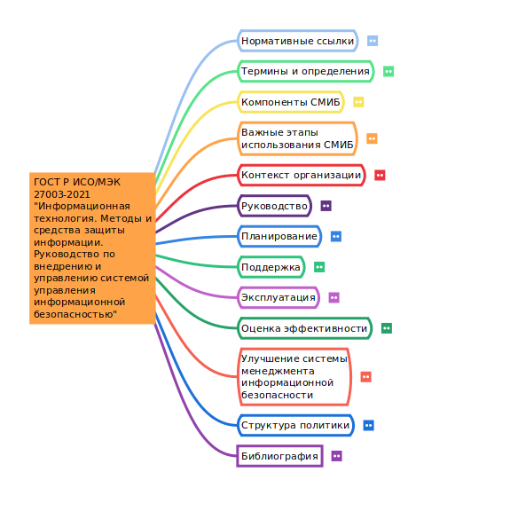

# Создание ментальной карты
Александр Смирнов

## Цель работы

1.  Изучить международные и российские стандарты, связанные с
    информационной безопасностью

2.  Получить навыки систематизации информации с помощью ментальной карты

## Ход выполнения практической работы

С [веб-ресурса “Электронный фонд правовых и нормативно-технических
документов”](https://docs.cntd.ru/document/1200179612) был скачан текст
стандарта ГОСТ Р ИСО/МЭК 27003-2021 “Информационная технология. Методы и
средства защиты информации. Руководство по внедрению и управлению
системой управления информационной безопасностью”.

Далее, с помощью программы Freeplane была создана ментальная карта:

## Оценка результата

В ходе выполнения практической работы была создана ментальная карта
(файл ISO27003-2021.mm) по стандарту ISO27003-2021 “Информационная
технология. Методы и средства защиты информации. Руководство по
внедрению и управлению системой управления информационной
безопасностью”.

## Выводы

Таким образом, с помощью ментальной карты удалось систематизировать
информацию о стандарте в удобном для чтения виде.
